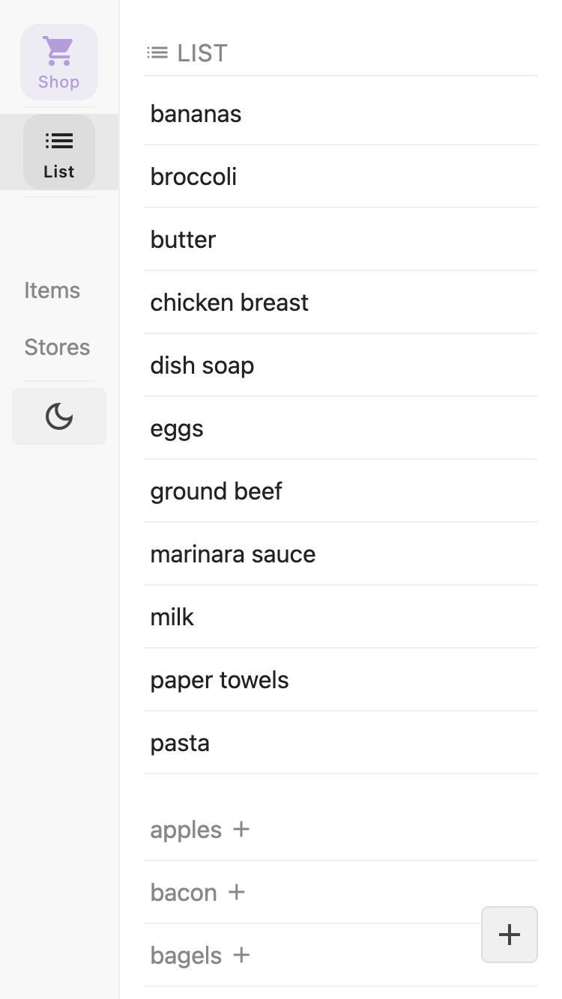
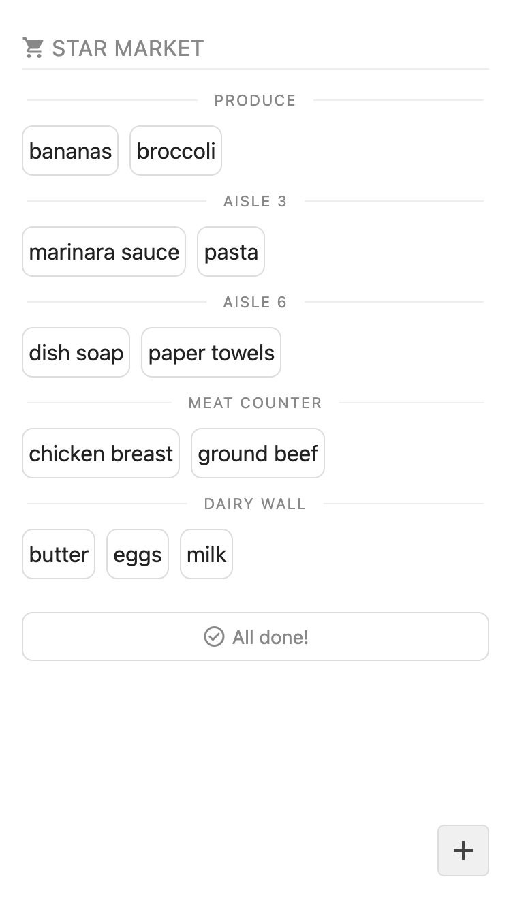

# Shopping

<p align="center">
  
  
</p>

## How to run

Run `shopping` with Docker. `shopping` listens on port `80`. You'll need to run as the root user.

To merely test out the app on local port `:8080`, run

```sh
docker run --publish 8080:80 --rm ghcr.io/smallcodebases/shopping:1
```

Otherwise, you'll likely want to use `docker compose` with a `compose.yaml` to define a persistent volume and other
settings declaratively.

Here is an example file to get you started.

```yaml
name: "shopping"

services:
  shopping:
    container_name: "shopping"
    image: "ghcr.io/smallcodebases/shopping:1"
    restart: "unless-stopped"
    volumes:
      - source: "data"
        target: "/var/lib/shopping"
        type: "volume"

volumes:
    data:
```

(You may prefer a "bind" type volume instead, if you want to poke around the SQLite database manually on the host
filesystem).


## Configuration

| Env var | Default | Meaning |
| --- | --- | --- |
| `SHOPPING_ADDR` | `:80` | Address that server listens on |
| `SHOPPING_DATA_DIR` | `/var/lib/shopping` | Directory where SQLite files are stored |
