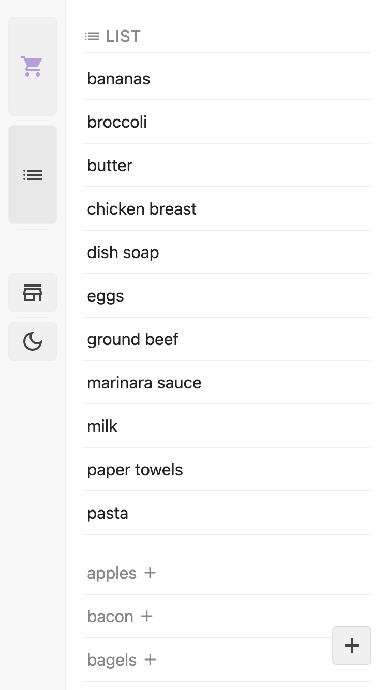
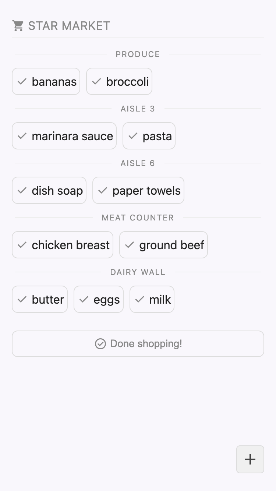

# Shopping

<p align="center">
  
  
</p>

## About

Shopping is a self-hosted shopping list app for a single household. You manage items ("milk"), stores ("Target"), and
sections within each store ("Aisle 4").

When it's time to shop, you pick a store and get your list grouped by section, in the section order that you configure.

Needless to say, this greatly streamlines the shopping experience, just work through your shopping list from top to bottom!

## Self-hosting

To test out Shopping on local port `:8080`, run

```sh
docker run --publish 8080:80 --rm ghcr.io/smallcodebases/shopping:latest
```

Otherwise, you'll likely want to use `docker compose` with a `compose.yaml` to define a persistent volume and other
settings declaratively.

Here is an example file to get you started.

```yaml
name: "shopping"

services:
  shopping:
    container_name: "shopping"
    image: "ghcr.io/smallcodebases/shopping:latest"
    restart: "unless-stopped"
    volumes:
      - source: "data"
        target: "/var/lib/shopping"
        type: "volume"

volumes:
    data:
```

## Configuration

| Env var | Default | Meaning |
| --- | --- | --- |
| `SHOPPING_ADDR` | `:80` | Address that server listens on |
| `SHOPPING_DATA_DIR` | `/var/lib/shopping` | Directory where SQLite files are stored |

## Versioning

Shopping doesn't follow SemVer or any other official versioning specification. Each new version is simply tagged with
a number 1 higher than the previous release, beginning with 1. Additionally, the Docker image tag `latest` refers to
the latest release number.

New releases will always be compatible with old releases (bugs notwithstanding), and will simply automatically migrate
your data on startup, if necessary. Feel free to therefore either run version `latest`, and re-download the image with
that tag as often as you'd like, or run a specific version, and manually look at this repo for updates as often as you'd
like.

## Authentication

Shopping has no authentication layer of its own. It assumes it runs on your home network where only authorized users can
reach it. If you need authentication, use [Tinyauth](https://github.com/steveiliop56/tinyauth) or similar. If you want
different users to have access to different shopping lists, just run multiple instances of Shopping.

## Changelog

See [CHANGELOG.md](./CHANGELOG.md).

## Development

You'll need the Go compiler, the Elm compiler, and SQLite on your path.

If you use Nix, a `flake.nix` is provided in this repo.

With [direnv](https://direnv.net/) and [nix-direnv](https://github.com/nix-community/nix-direnv), create a `.envrc`:

```sh
echo "use flake" > .envrc && direnv allow
```

This splices the dev dependencies into your current shell session automatically whenever you enter the directory.

Alternatively, `nix develop` drops you into a dev shell directly, but (without further faffing about) may change your
environment in undesirable ways, because it doesn't know what shell you normally use, so doesn't source its config.

Once you have the dependencies, run:

```sh
elm make Main.elm --output main.js
SHOPPING_ADDR=":8080" SHOPPING_DATA_DIR="." go run .
```

This compiles the Elm frontend to `main.js`, then starts the server on `:8080` with the SQLite database stored in the
current directory.

## Contributing

I don't accept pull requests at this time. However, I am happy to discuss new feature ideas with you in the issue
tracker.

The codebase is also very small, just [one Go file](./main.go) for the backend and [one Elm file](./Main.elm) for the frontend. If you'd like to
take this project in another direction, I encourage you to fork the codebase and take ownership. Just be sure to respect
the license!

## License

[GNU Affero General Public License v3.0](./LICENSE)
